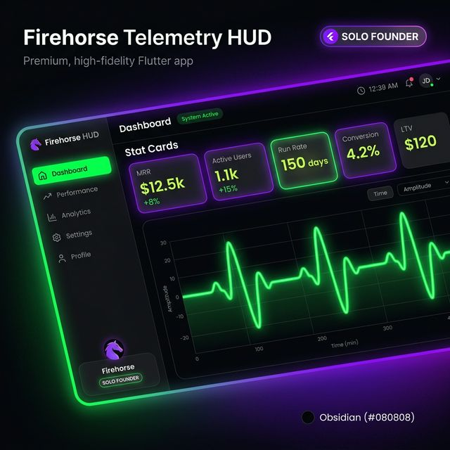
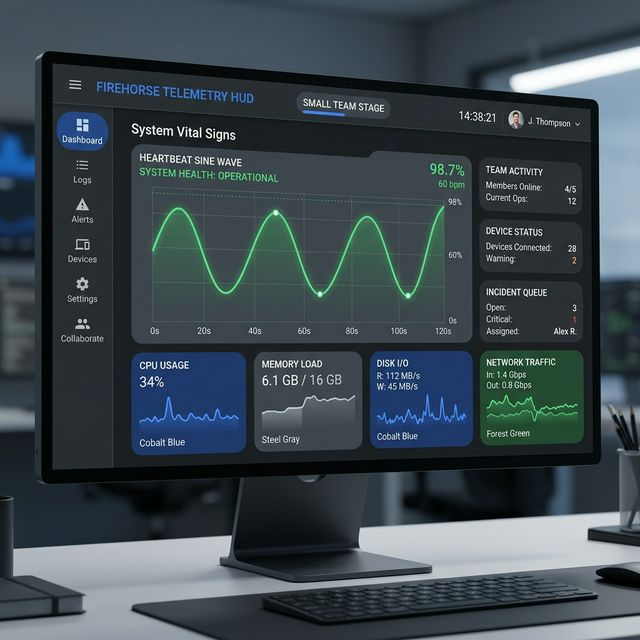
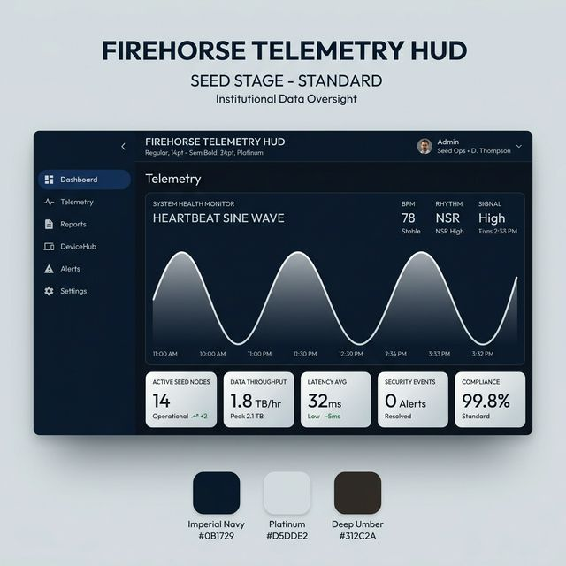
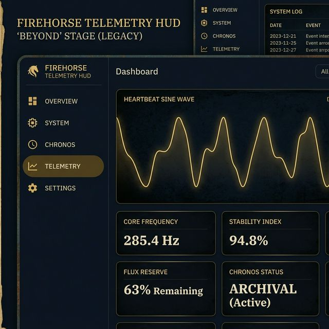
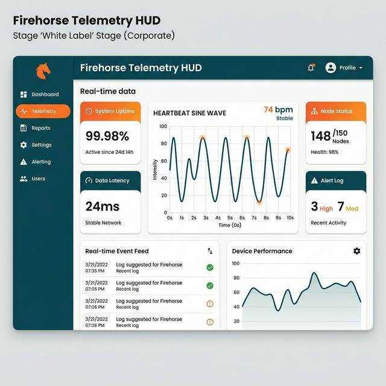

# GitSovereign HUD: Chromatic Graduation Review
**DATE:** 2026-03-24 | **PROJECT:** CYC-00269 (HUD-M3)

This document chronicles the visual evolution of the GitSovereign Interaction Surface as it scales across institutional maturity tiers using the **Material 3 (M3) 47-color role system**.

---

## 🚀 Stage I: Solo Founder
*Vibe: Agility, Kinetic Energy, High-Contrast*
- **Primary:** Electric Violet
- **Secondary:** Cyber Lime
- **Tertiary:** Obsidian

---

## 🏢 Stage II: Small Team
*Vibe: Structure, Cohesion, Growth*
- **Primary:** Refined Cobalt
- **Secondary:** Steel Gray
- **Tertiary:** Forest Green

---

## 🏛️ Stage III: Seed Stage (Fleet Standard)
*Vibe: Trust, Professionalism, Institutional Weight*
- **Primary:** Imperial Navy
- **Secondary:** Platinum
- **Tertiary:** Deep Umber

---

## 🏺 Stage IV: Beyond
*Vibe: Legacy, Preservation, Timelessness*
- **Primary:** Deepest Midnight Blue
- **Secondary:** Burnished Gold
- **Tertiary:** Antique Bone

---

## 🏷️ Stage V: White Label
*Vibe: Flexibility, Corporate Optimization*
- **Primary:** Deep Teal
- **Secondary:** Energetic Orange
- **Tertiary:** Pure White

---

### 🛡️ Institutional Verification
All stages utilize the standard **`MaturityTier`** engine and are fully **WASM-GC compliant**. The M3 role mapping ensures 100% theme reactivity across all fleet interaction surfaces.
